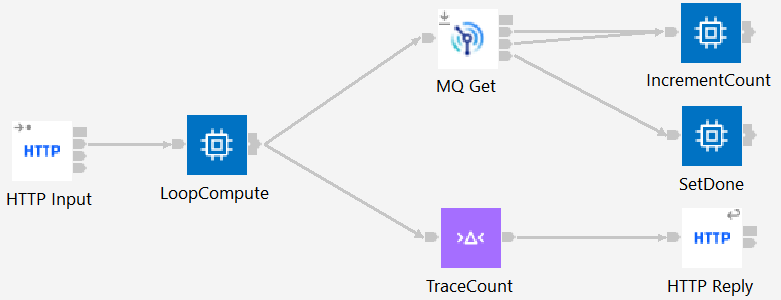
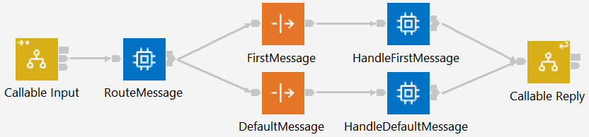
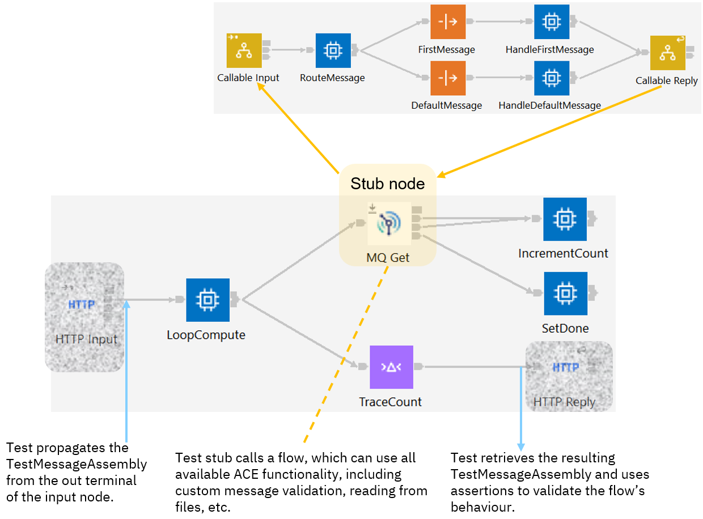

# ace-cf-test-mock
Examples of using callable flows as test mocks for ACE testing

The main application in this repo relies on MQ in a way that can seem difficult to test without having 
an actual queue manager available; while it is possible to test this flow with component tests 
([unit tests that are allowed to access external resources](https://community.ibm.com/community/user/integration/blogs/trevor-dolby/2023/03/20/app-connect-enterprise-ace-unit-and-component-test)), 
unit testing is also possible using callable flow mocks.

## Overview

The [CountMQMessages](CountMQMessages) application contains a simple example of a flow that is 
difficult to unit test using static node mocking (such as using propagatesMessage() on a NodeStub 
object), but can be tested with the more dynamic approach of using callable flows to implement a 
mock node. The flow itself looks as follows:



and is designed to count the number of messages on SYSTEM.DEFAULT.LOCAL.QUEUE when invoked via HTTP.

(Note that as this is an example of testing rather than application design, the MQGet node does not browse the 
messages and therefore this flow clears the queue: using browse would avoid this, but would also 
require the flow to reset the browse cursor for the first MQGet node invocation for each HTTP request, 
thereby complicating the flow).

The flow can be deployed and invoked via curl, producing results such as
```
$ curl http://localhost:7800/CountMQMessages
{"count":4}
```

## Unit testing

Testing the application in isolation (without an actual MQ queue manager) is complicated by the need for
the MQGet node to change behavior from one call to the next: for the first call (or first few calls), the
node should propagate an actual message to the "Out" terminal in order to drive the IncrementCount Compute
node, but then it should propagate to the "No Message" terminal to simulate having run out of messages.

Using a standard NodeSpy.onCall().propagatesMessage() or NodeSpy.onCall().propagatesInputMessage() call 
would not allow for dynamic behavior, so instead the invokesCallableFlow() method is used. The flow to be
called looks as follows:



and provides the needed dynamic capabilities. The "FirstMessage" and "DefaultMessage" nodes are Passthru 
nodes that will themselves be mocked by the unit test: the unit test knows which messages it is expecting
and so is the obvious place to specify which messages should be loaded. It is possible to load stored
messages (mxml files) in the flow itself, but it is much easier to use the standard unit test capabilities.

The "HandleFirstMessage" and "HandleDefaultMessage" nodes are Compute nodes that can alter the output
terminal from which the loaded message is propagated. This allows the callable flow to choose which 
path to take in the application flow, using a LocalEnvironment setting to specify the terminal:
```
    SET OutputLocalEnvironment.Stub.Support.OutputTerminalName = 'out';
```
(see [MQGet_HandleFirstMessage.esql](UnitTest_Mocks/MQGet_HandleFirstMessage.esql) for details).

In this simulated case, only the first messages is found, and subsequent calls find no messages available, 
so the default is to propagate to the "No Message" terminal:
```
    mqgetStub.onCall().invokesCallableFlow("in",  "noMessage", "UnitTest_Mocks", "MQGetMock");
```
(see [CountMQMessages_HTTPFlow.java](CountMQMessages_UnitTest/src/main/java/test/ace/CountMQMessages_HTTPFlow.java) for details).

When combined with the main flow and the unit test itself, the overall picture is



with the callable flow loading the first message and sending it down the MQGet node "Out" terminal and
then sending any subsequent calls to the "No Message" terminal. This allows the unit test to run the
flow end-to-end and verify the behavior is as expected.

### Notes

- The test project references both main application and the mock provider application to ensure they are both deployed.
- Message flow threads must be started, which is not the default for unit test projects. The [launch configuration](CountMQMessages_UnitTest/CountMQMessages_UnitTest.launch)
  for the unit test project has `startFlowThreads` set to true for this reason.

